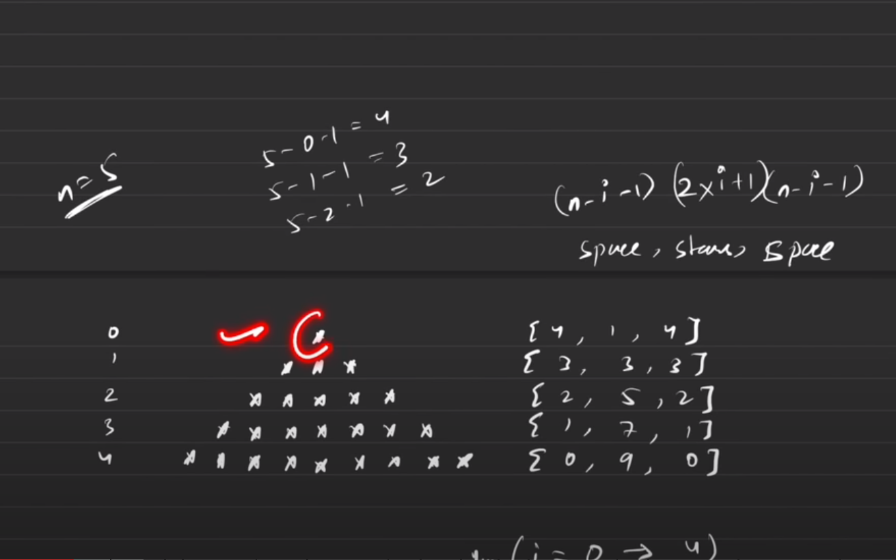

# Patterns

=> for the outer loop count the No. of lines or row.
=> for the inner loops, focus on the columns, and connect the somehow to the row.
=> print them ("\*") inside the inner for loop
=> observe symmetry [optional]

